# 📨 ChatPulse — Messaging System (From Basic to Advanced)

> This document explains **exactly how a message travels** from the moment a user presses Send, to the moment every participant sees it — covering Direct Chats, Groups, and Channels, including media, replies, mentions, @Chugli Bot, AI Auto-Pilot, and real-time delivery.

---

## 1. Architecture Overview

ChatPulse messaging is a **3-layer system**:

| Layer | Technology | Role |
|---|---|---|
| **Frontend** | Alpine.js + Blade (no framework) | Captures input, shows messages, polls for updates |
| **Backend** | Laravel 11 (PHP) | Validates, stores, broadcasts |
| **Real-time** | Laravel Echo + Pusher / AJAX Polling fallback | Pushes events to other participants |

---

## 2. Conversation Types

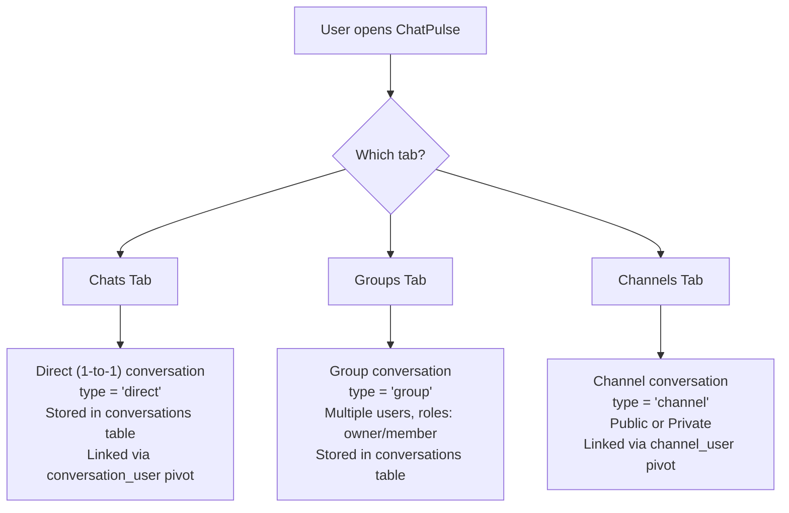

**Key DB Tables:**
- `conversations` — stores all chat types (direct, group, channel)
- `conversation_user` — pivot for groups (with `role` column: owner/member)
- `channel_user` — pivot for channels (with `role` column: owner/admin/member)
- `messages` — every single message ever sent

---

## 3. Initiating a Direct Chat

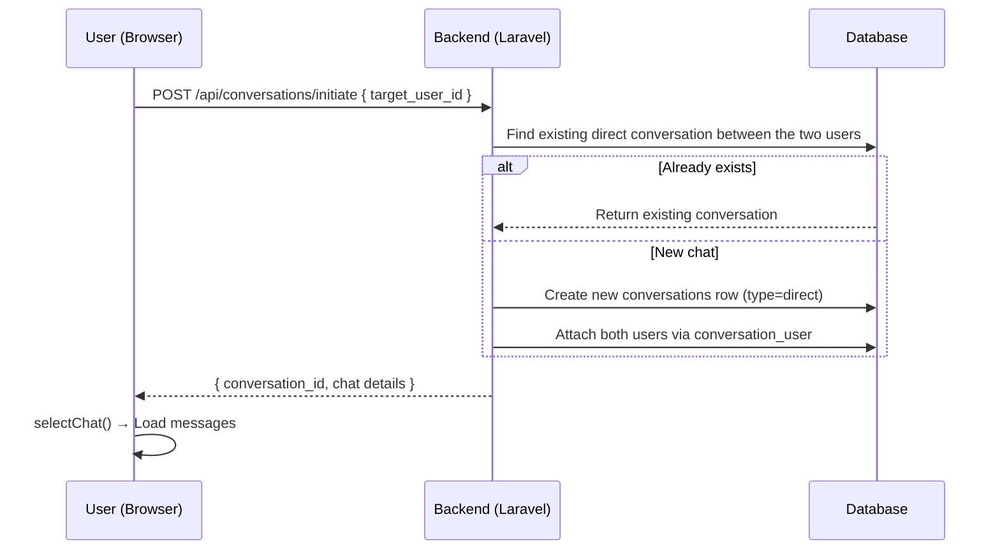

**Code Path:**
- Route: `POST /api/conversations/initiate`
- Controller: `DashboardController::initiateConversation()`
- The system first checks if a conversation between these two users already exists to avoid duplicates.

---

## 4. Sending a Text Message — Step by Step

### 4a. Frontend Side (Alpine.js)

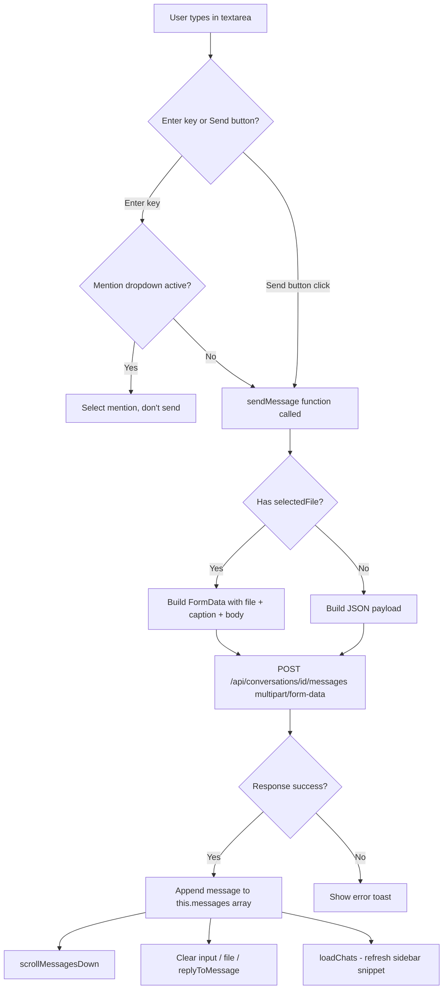

### 4b. Backend Side (DashboardController::sendMessage)

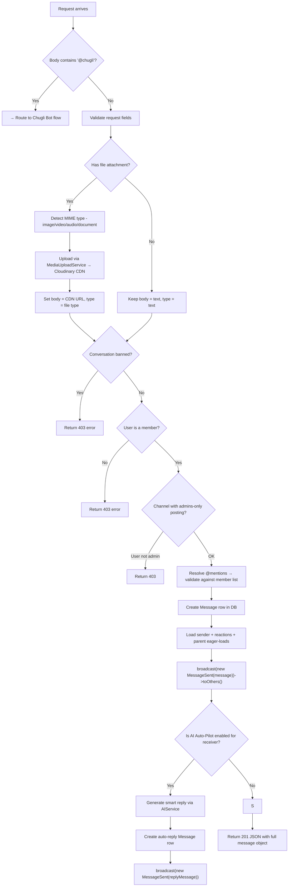

---

## 5. Media Upload Flow (Images, Videos, PDFs, Audio)

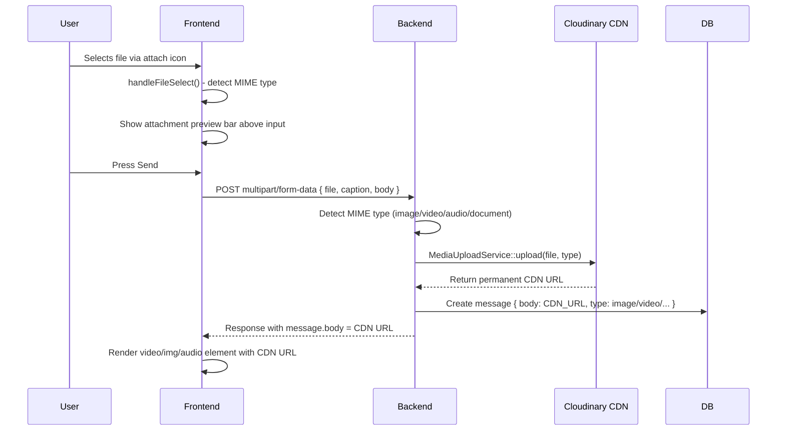

**Why CDN?** Files are stored on Cloudinary so they:
- Load fast globally
- Never expire
- Support transcoding for video

---

## 6. Threaded Replies (Quote-Reply)

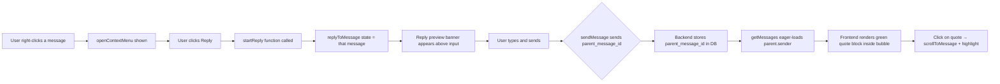

**DB Column:** `messages.parent_message_id` → foreign key to `messages.id`

---

## 7. @Mention System

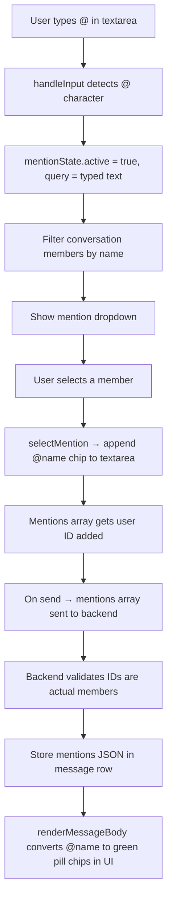

---

## 8. Real-Time Delivery (WebSocket + Polling Fallback)

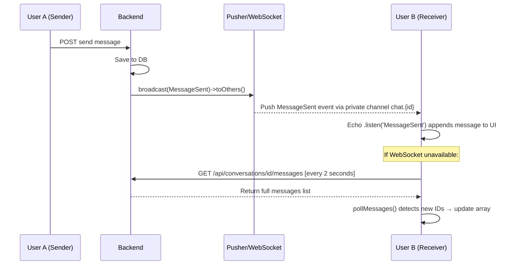

**Channel name:** `private-chat.{conversation_id}`

**Events broadcast:**
| Event | When |
|---|---|
| `MessageSent` | New message sent |
| `MessageRead` | Other user opens chat |
| `UserTyping` | User is typing |
| `ReactionUpdated` | Emoji reaction toggled |
| `MessageDeleted` | Message deleted |

---

## 9. Group Chat — Creating and Messaging

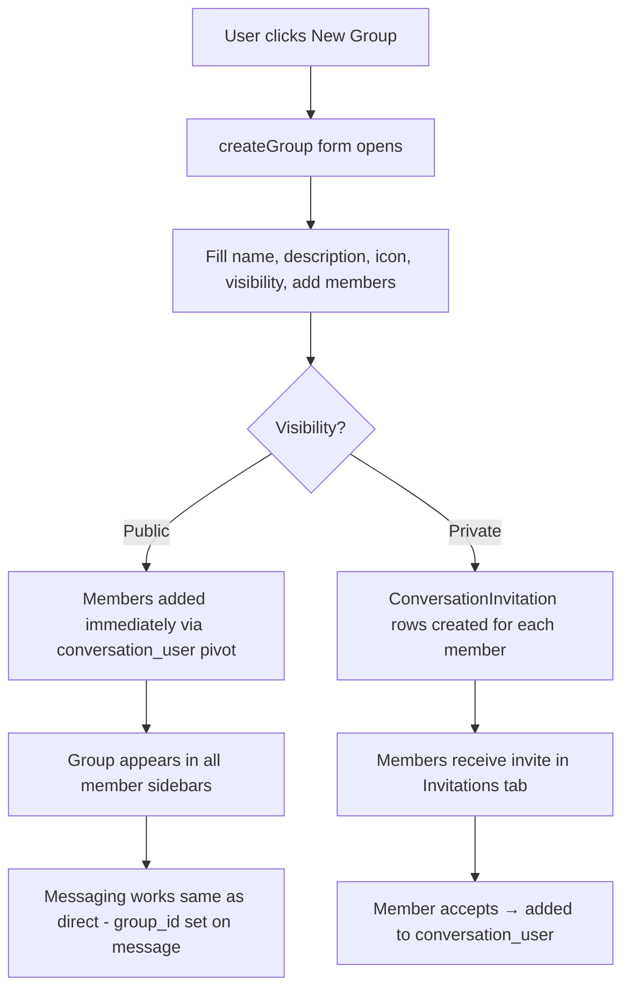

---

## 10. Channel — Creating and Posting

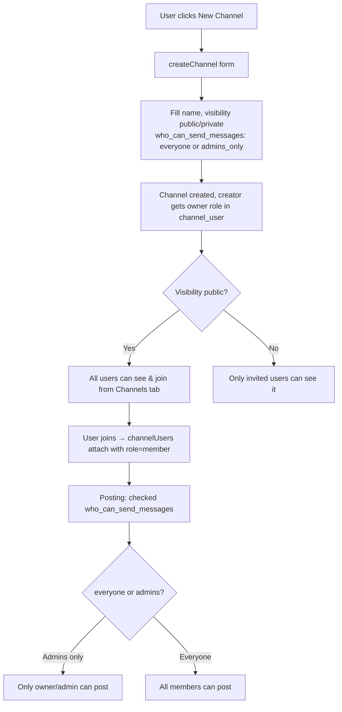

---

## 11. Message State Machine

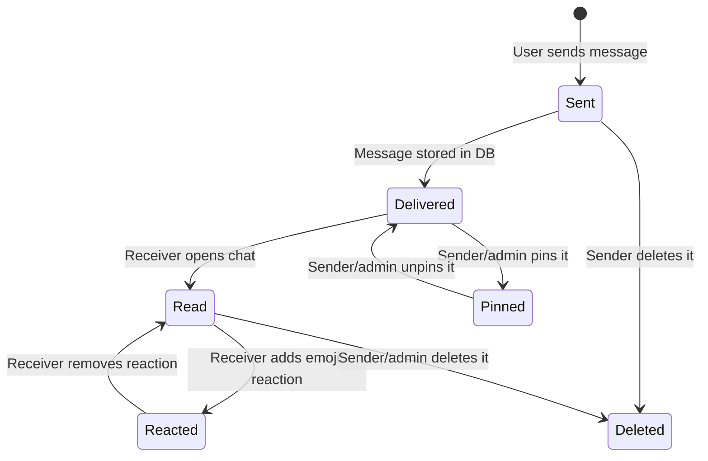

**Ticks in UI:**
- ✓ (single gray) = Sent
- ✓✓ (double gray) = Delivered (stored in DB)
- ✓✓ (double blue) = Read (receiver opened chat)

---

## 12. Typing Indicator

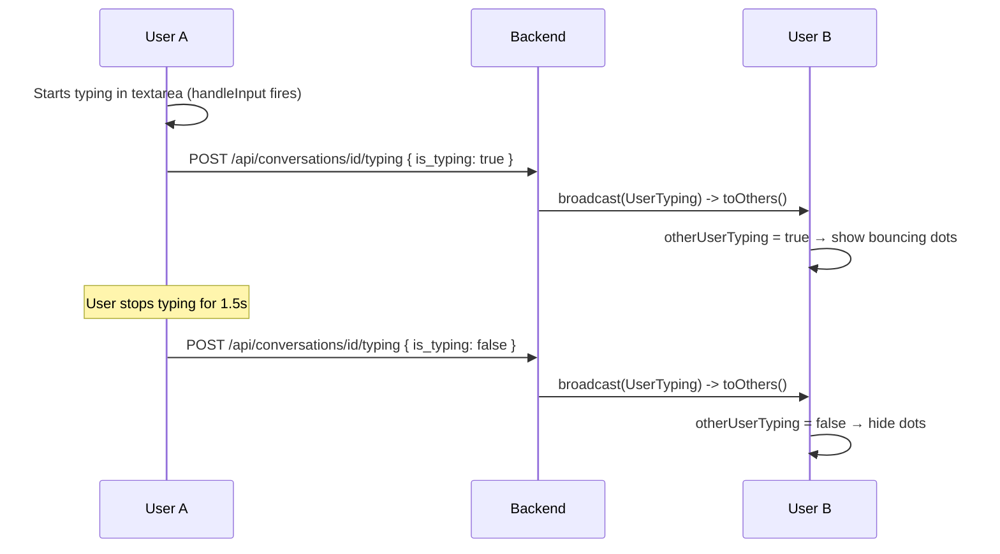

---

## 13. Key Files Reference

| File | Purpose |
|---|---|
| `app/Http/Controllers/DashboardController.php` | All messaging endpoints |
| `app/Services/MediaUploadService.php` | Cloudinary file upload |
| `app/Events/MessageSent.php` | WebSocket broadcast event |
| `app/Models/Message.php` | Message model + relationships |
| `app/Models/Conversation.php` | Conversation model |
| `resources/views/dashboard.blade.php` | Entire frontend (Alpine.js) |
| `routes/web.php` | All API route definitions |
