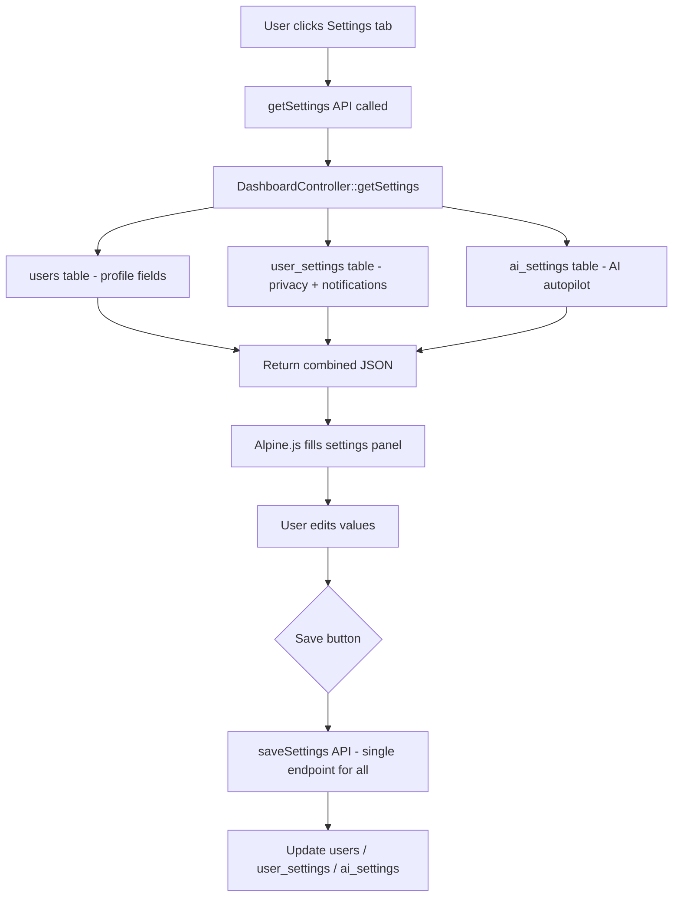
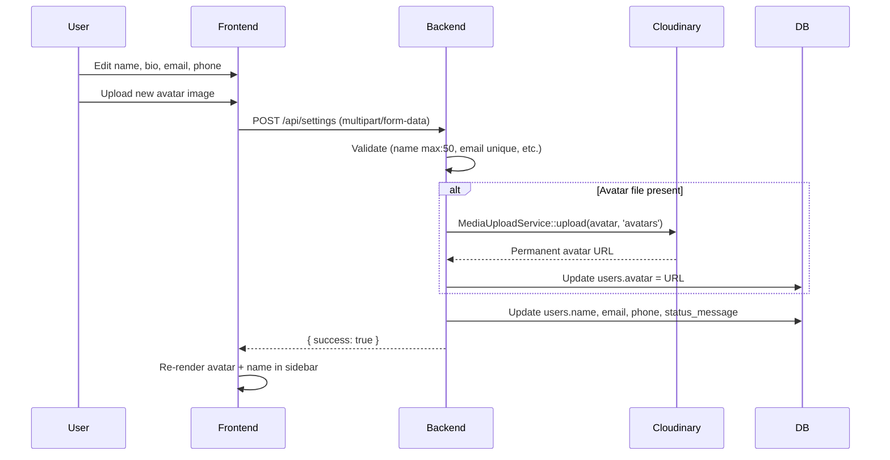
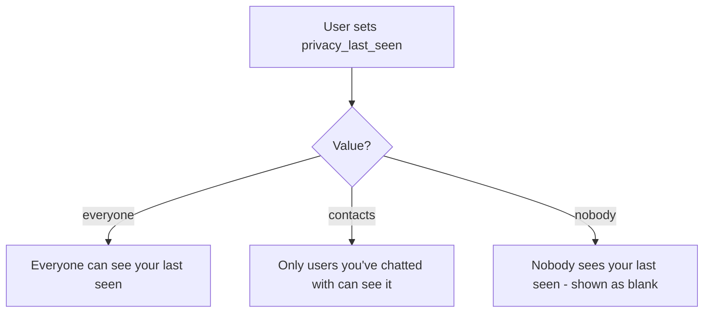
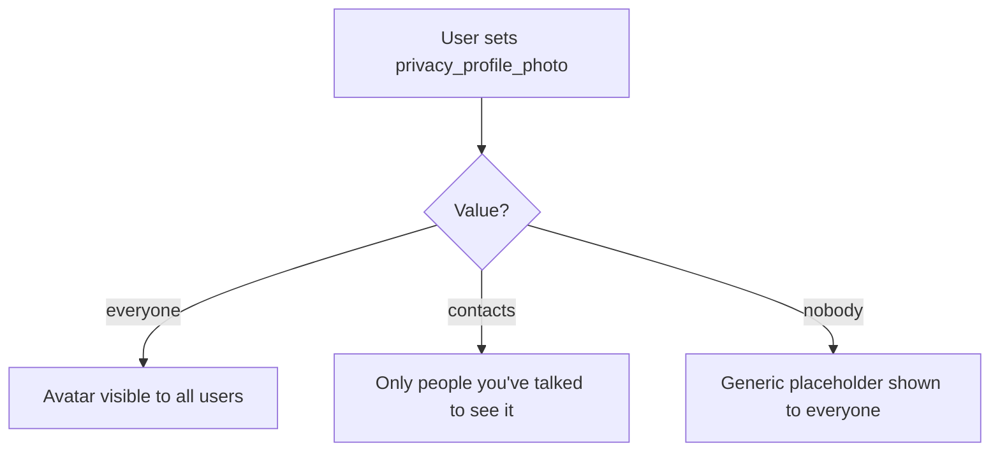
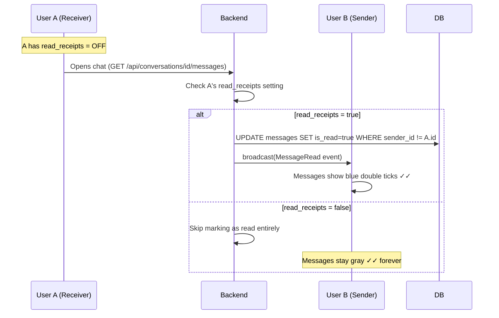
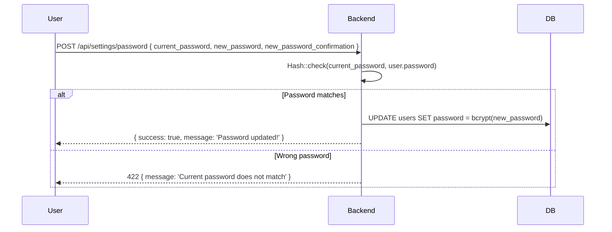
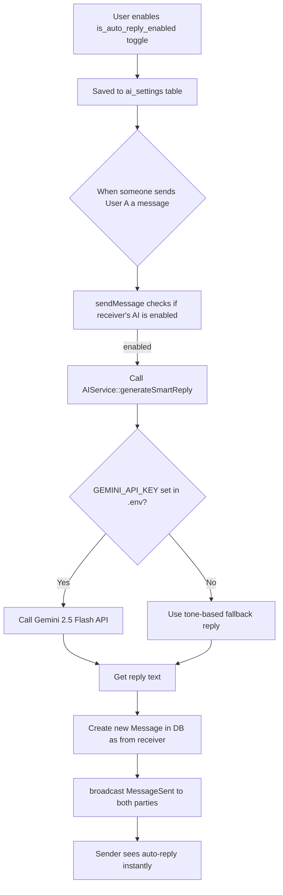
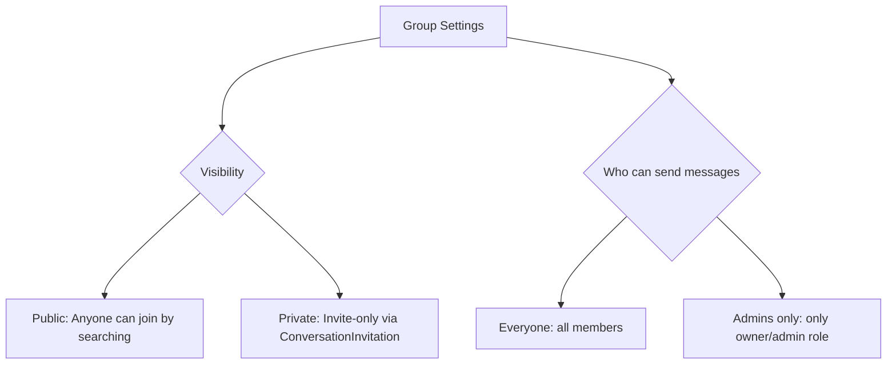
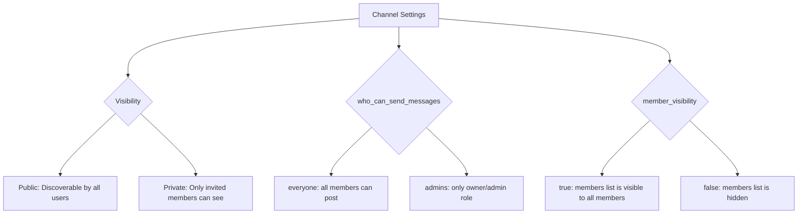
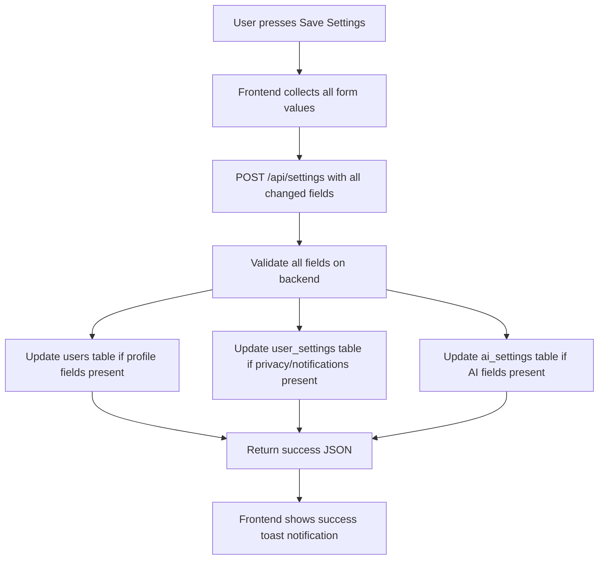

# ⚙️ ChatPulse — Settings System (Complete Reference)

> This document explains every setting in ChatPulse — what it does, where it is stored, and how it affects the application behaviour.

---

## 1. Settings Architecture



---

## 2. Database Tables

### `users` table (Profile fields)
| Column | Type | What it controls |
|---|---|---|
| `name` | string | Display name shown in all chats |
| `email` | string unique | Login email |
| `phone` | string | Phone number |
| `avatar` | string (URL) | Profile photo (Cloudinary URL) |
| `status_message` | string | Bio / "About" text shown in profile |
| `status` | enum | `active` or `banned` |
| `role` | enum | `user` or `admin` |

### `user_settings` table (Privacy + Notifications)
| Column | Type | Default | What it controls |
|---|---|---|---|
| `privacy_last_seen` | enum | `everyone` | Who can see your last seen |
| `privacy_profile_photo` | enum | `everyone` | Who can see your avatar |
| `read_receipts` | boolean | `true` | Blue ticks on/off |
| `notification_push` | boolean | `true` | Push notifications |
| `notification_sounds` | boolean | `true` | Notification sounds |
| `notification_previews` | boolean | `true` | Message preview in notification |

### `ai_settings` table (AI Features)
| Column | Type | Default | What it controls |
|---|---|---|---|
| `is_auto_reply_enabled` | boolean | `false` | AI Auto-Pilot replies on your behalf |
| `tone` | enum | `Professional` | Auto-reply tone: Professional/Casual/Direct |
| `prompt_behavior` | text | empty | Custom personality/instruction for AI |
| `summary_frequency` | enum | `daily` | How often Chugli summarises chats |

---

## 3. Profile Settings



**Validation Rules:**
- `name` → max 50 characters
- `email` → must be unique across all users
- `phone` → must be unique across all users
- `avatar` → max 5MB, JPEG/PNG/GIF/JPG only

---

## 4. Privacy Settings

### 4a. Last Seen Privacy



> **Note:** Last seen is controlled by the `privacy_last_seen` setting stored in `user_settings`. The frontend reads this when rendering contact info.

### 4b. Profile Photo Privacy



### 4c. Read Receipts (Blue Ticks)



**Logic Location:** `DashboardController::getMessages()` lines 229-248.

---

## 5. Notification Settings

| Setting | Effect |
|---|---|
| `notification_push` | Enables/disables browser push notifications (future: mobile) |
| `notification_sounds` | Plays a chime when a new message arrives |
| `notification_previews` | Shows message text preview in the notification badge |

> These settings are stored in `user_settings` and read by the frontend Alpine.js to decide whether to play sounds or show previews.

---

## 6. Password Change



---

## 7. AI Settings Panel

### 7a. Auto-Reply (AI Autopilot)



### 7b. Tone Options

| Tone | Example Auto-Reply |
|---|---|
| **Professional** | "Great point. I will review and update you soon. 👍" |
| **Casual** | "No worries, sounds good! 😎" |
| **Direct** | "Understood. Will look into it." |

### 7c. Custom Personality Instructions

User can write custom behavior like:
- _"Always reply in Hindi"_
- _"Start every reply with a joke"_
- _"Be very formal and never use emojis"_

This text is sent as part of the Gemini API prompt:
```
Follow these custom personality guidelines: {prompt_behavior}
```

---

## 8. Group & Channel Settings (Admin Controls)

### Group Permission Settings

When creating or managing a group, the creator (owner) controls:



### Channel Permission Settings



---

## 9. Full Settings Save Flow



> **Design:** The save endpoint accepts **any subset** of settings — it only updates fields that are present in the request, leaving others unchanged.

---

## 10. Key Files Reference

| File | Purpose |
|---|---|
| `app/Http/Controllers/DashboardController.php` | `getSettings()` + `saveSettings()` + `changePassword()` |
| `app/Models/UserSetting.php` | Privacy + notification settings model |
| `app/Models/AISetting.php` | AI settings model |
| `app/Services/AIService.php` | Auto-reply + Chugli bot logic |
| `resources/views/dashboard.blade.php` | Settings panel UI (line ~757 onwards) |
| `database/migrations/` | Schema for user_settings + ai_settings tables |
