# 😍 ChatPulse — Reactions, Pin, Delete, Forward & AI Features

> This document covers all message interactions (reactions, pin, delete, forward) and all AI-powered features (Auto-Reply, Chugli Bot, Content Moderation, Smart Reply, AI Logs).

---

## PART A — Message Interactions

---

## 1. Reaction System (Emoji Reactions)

### 1a. Database Schema

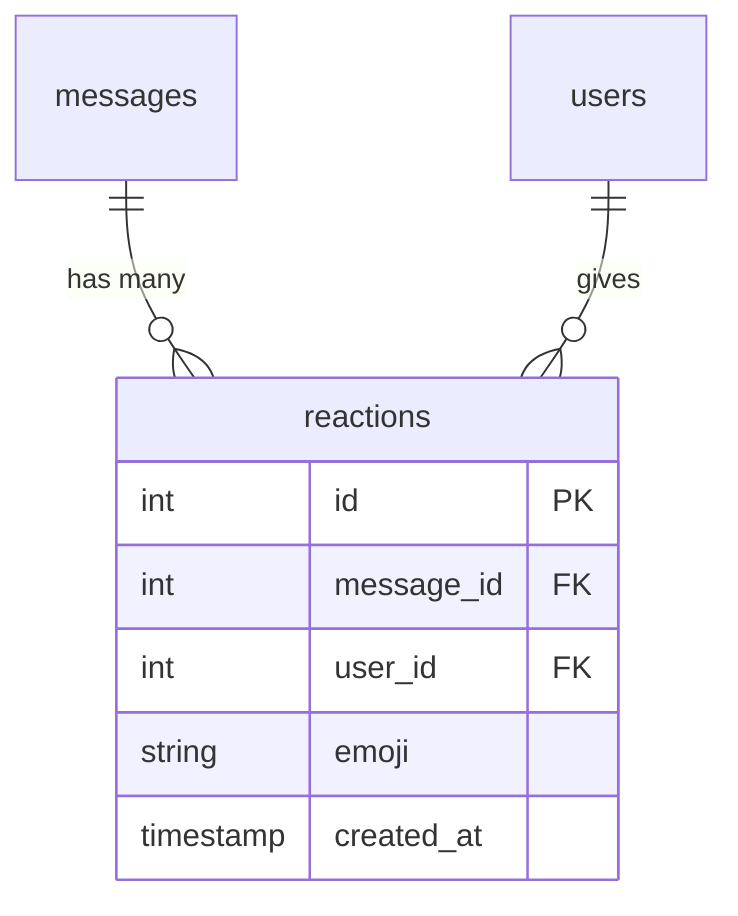

**Rule:** Each user can only have **one reaction per message** (the system toggles or replaces).

### 1b. How Reacting Works

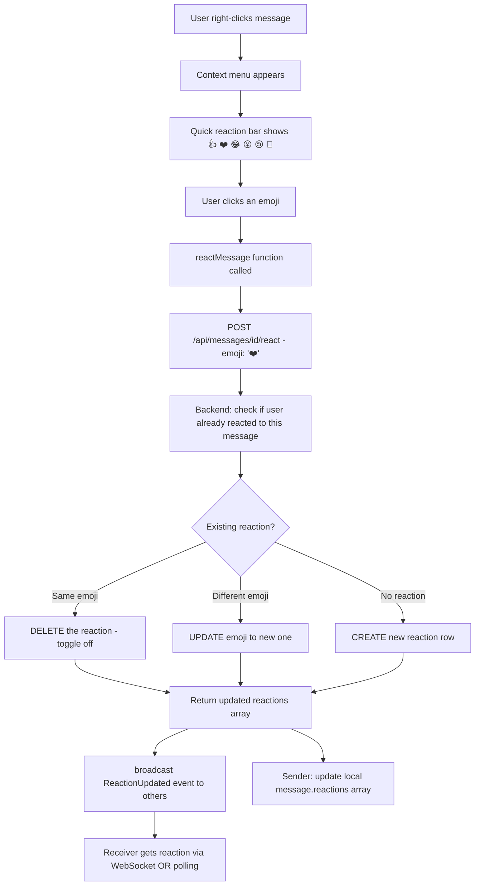

### 1c. How Reactions Are Displayed

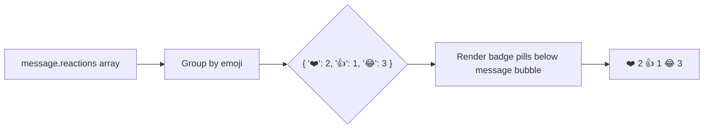

**Code location:** Alpine.js `groupReactions()` computed function → renders under each message bubble.

### 1d. Real-Time Reaction Sync

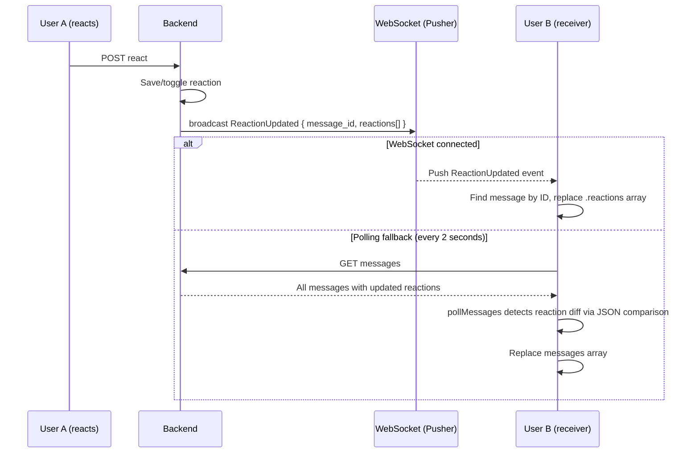

**Why JSON comparison?** Each reaction is serialized as `emoji+user_id` string, sorted, and JSON-stringified. If the string differs, the UI refreshes that message.

---

## 2. Pin Message

### 2a. Database Column
`messages.is_pinned` → `boolean`, default `false`.

### 2b. Pin Flow

```mermaid
flowchart TD
    A[User right-clicks message] --> B[Context menu]
    B --> C["Pin Message / Unpin Message option"]
    C --> D[pinMessage function called]
    D --> E[POST /api/messages/id/pin]
    E --> F[Backend: check auth - sender OR admin OR group creator]
    F --> G{Authorized?}
    G -->|No| H[Return 403]
    G -->|Yes| I["UPDATE messages SET is_pinned = !is_pinned"]
    I --> J["Return { success, is_pinned, message_id }"]
    J --> K[Frontend: update messages[idx].is_pinned immediately]
    K --> L{is_pinned = true?}
    L -->|Yes| M[Golden banner appears below chat header]
    L -->|No| N[Banner disappears]
    M --> O[Click banner → scrollToMessage]
    M --> P[✕ button on banner → calls pinMessage to unpin]
```

### 2c. Pinned Message UI

- **Golden banner** appears below the chat header when any message is pinned
- Shows the most recently pinned message content (truncated)
- Click the banner body → scrolls to that message and highlights it
- Press ✕ → immediately unpins
- Each pinned bubble shows a small 📌 `keep` icon at top-left corner
- Other participants see the pin via the 2-second polling cycle (`pollMessages` detects `is_pinned` diff)

---

## 3. Delete Message (Delete for Everyone)

### 3a. Authorization Rules

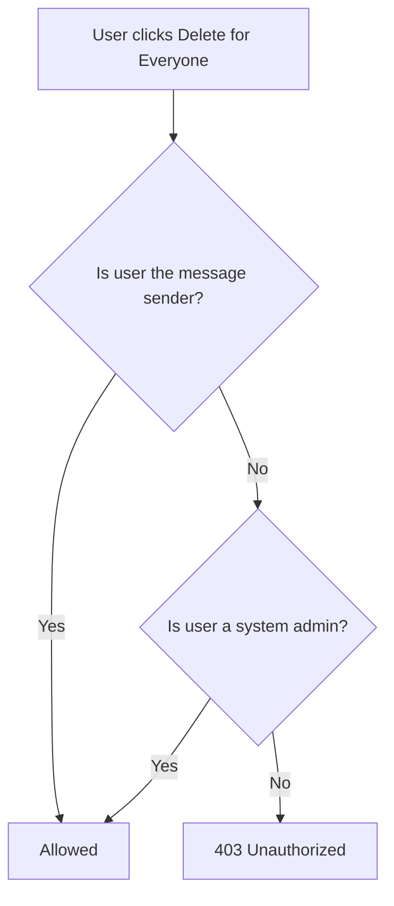

### 3b. Delete Flow

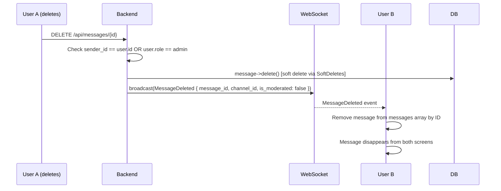

**Soft Delete:** Laravel's `SoftDeletes` trait means the row is NOT physically removed. `deleted_at` is set, and the message is hidden from queries via `whereNull('deleted_at')`.

---

## 4. Forward Message

### 4a. Forward Flow

```mermaid
flowchart TD
    A[User right-clicks message → Forward] --> B[openForwardModal called]
    B --> C[Forward modal opens with conversation list + search bar]
    C --> D[User searches for a chat]
    D --> E[User clicks a conversation to select it]
    E --> F[confirmForward called]
    F --> G[POST /api/messages/id/forward { conversation_id: targetId }]
    G --> H[Backend validates target conversation]
    H --> I[Backend checks user is a member of target]
    I --> J{Member?}
    J -->|No| K[403 error]
    J -->|Yes| L[Create a NEW message in target conversation]
    L --> M[Copy body, type, caption with 'Forwarded:' prefix]
    M --> N[Return 201 with new message object]
    N --> O[Close modal]
```

---

## PART B — AI Features

---

## 5. AI Feature Overview

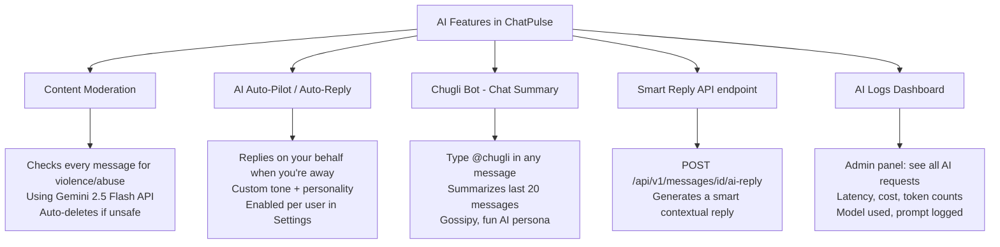

---

## 6. Content Moderation (Auto)

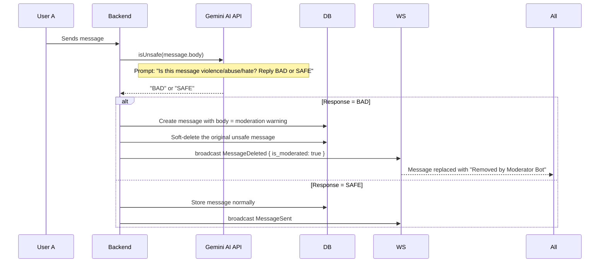

**Sandbox Mode (no API key):** Uses a hardcoded keyword list (`kill`, `murder`, `abuse`, `fuck`, `shit`, etc.) to detect unsafe content locally without an API call.

---

## 7. AI Auto-Reply (Autopilot)

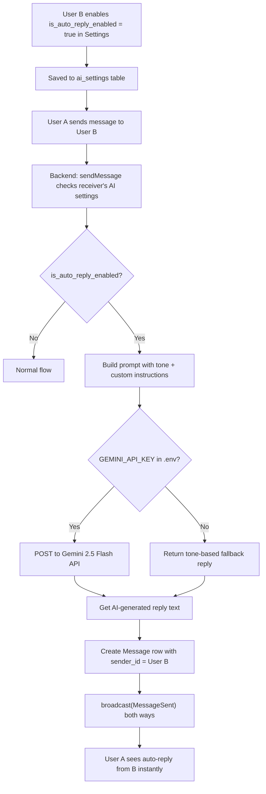

**Example Prompts Sent to Gemini:**
```
You are an automated AI assistant auto-replying on behalf of a user in ChatPulse.
Generate a short, natural reply (1 sentence max) to:
Tone: Professional
Custom guidelines: Always be polite and mention availability.
Incoming Message: "Are you free tomorrow?"
Reply:
```

---

## 8. Chugli Bot (@chugli)

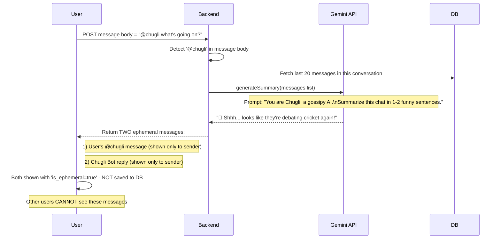

**Key Concept: Ephemeral Messages**
- `is_ephemeral: true` messages exist **only in the frontend state**
- They are NOT saved to the database
- Only the requesting user can see them
- They disappear on page refresh or chat switch

---

## 9. Smart Reply (AI-Assisted Compose)

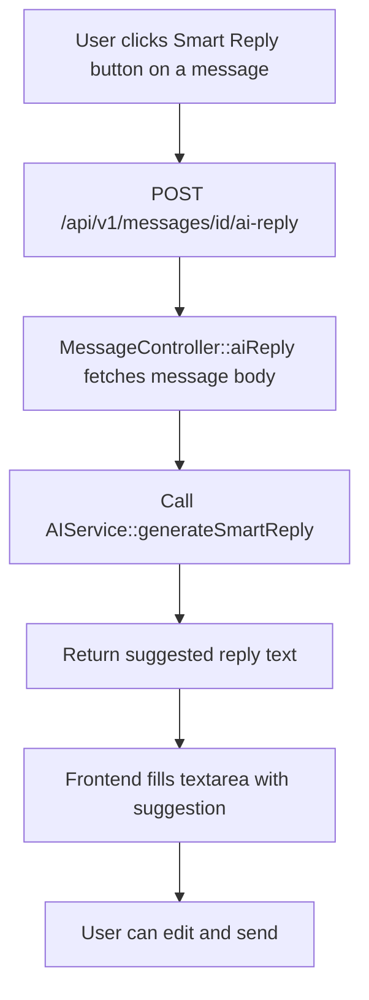

---

## 10. AI Logs (Audit Trail)

Every AI request is logged to the `ai_logs` table:

| Column | What's stored |
|---|---|
| `user_id` | Which user triggered it |
| `model` | `gemini-2.5-flash` |
| `status` | `success` or `failed` |
| `latency_ms` | How long API took (milliseconds) |
| `tokens_used` | Estimated token count |
| `cost` | Estimated cost ($0.00015 per 1k tokens) |
| `prompt` | Full prompt sent to Gemini |
| `response` | Full response received |

These logs are visible in the Admin Panel → AI Stats section.

---

## 11. AI API Key — Sandbox vs Live Mode

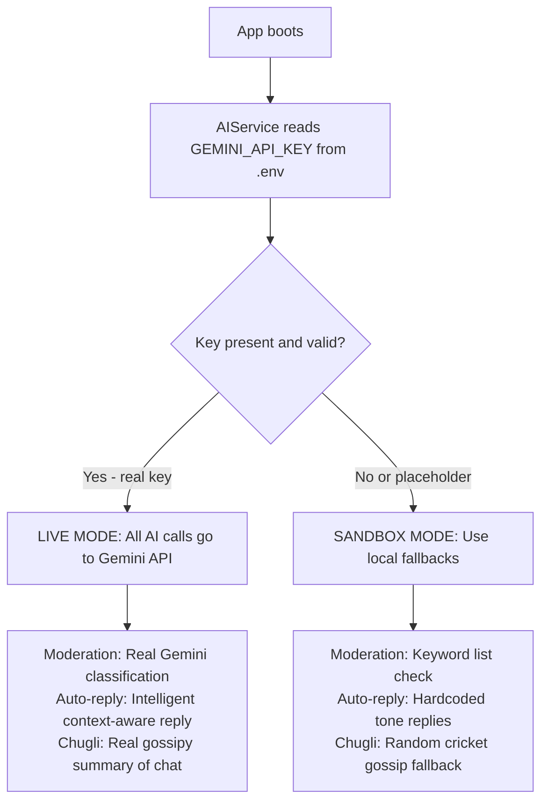

**To switch to LIVE mode:** Set `GEMINI_API_KEY=your_actual_key` in `.env` file.

---

## 12. Key Files Reference

| File | Purpose |
|---|---|
| `app/Services/AIService.php` | All AI logic: moderation, auto-reply, Chugli, smart reply |
| `app/Models/Reaction.php` | Reaction model |
| `app/Events/ReactionUpdated.php` | WebSocket event for reactions |
| `app/Events/MessageDeleted.php` | WebSocket event for deletes |
| `app/Http/Controllers/DashboardController.php` | `reactToMessage()`, `deleteMessage()`, `forwardMessage()`, `pinMessage()` |
| `app/Http/Controllers/Api/V1/MessageController.php` | `aiReply()`, `react()`, `forward()` (v1 API) |
| `database/migrations/*_create_reactions_table.php` | Reactions schema |
| `database/migrations/*_add_is_pinned_to_messages_table.php` | Pin column schema |
