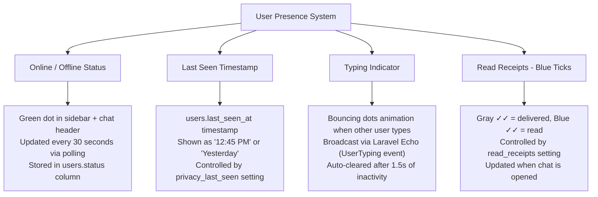
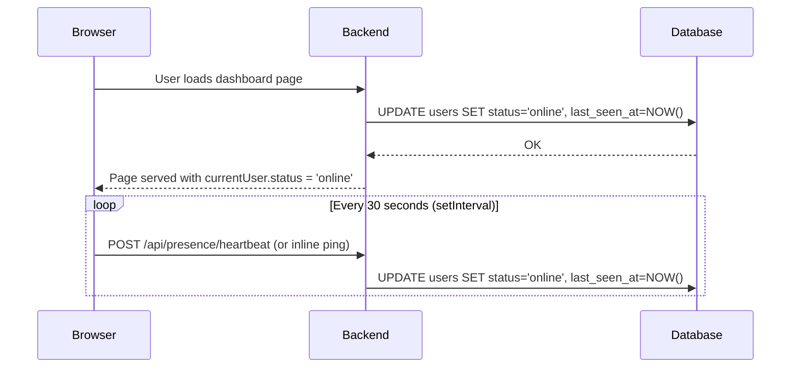
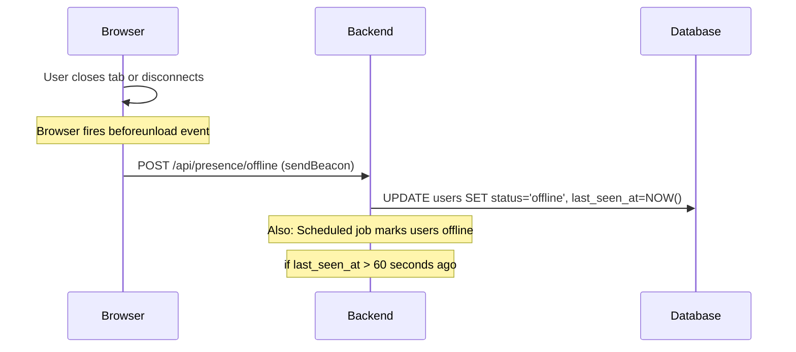
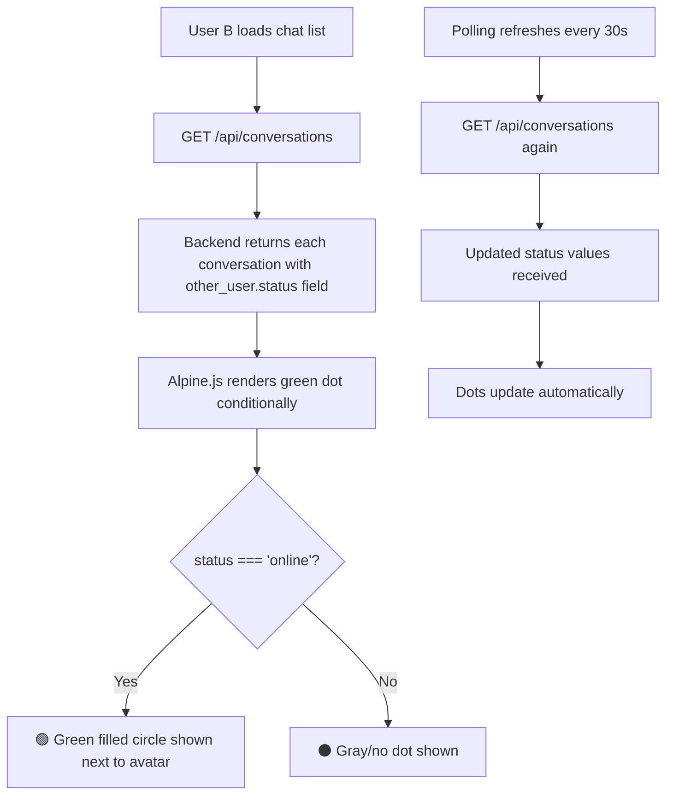
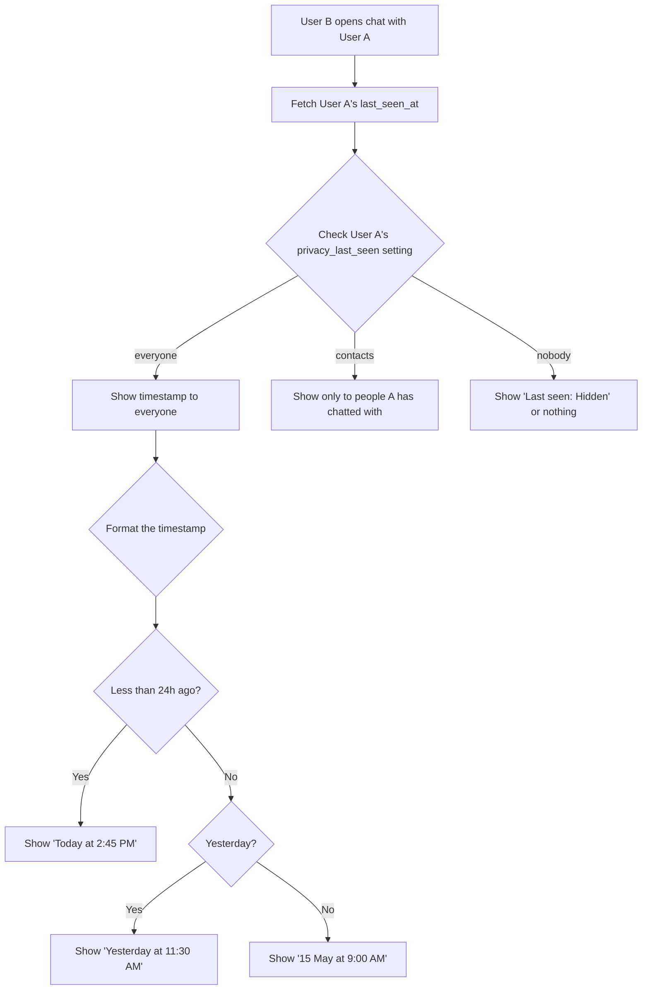
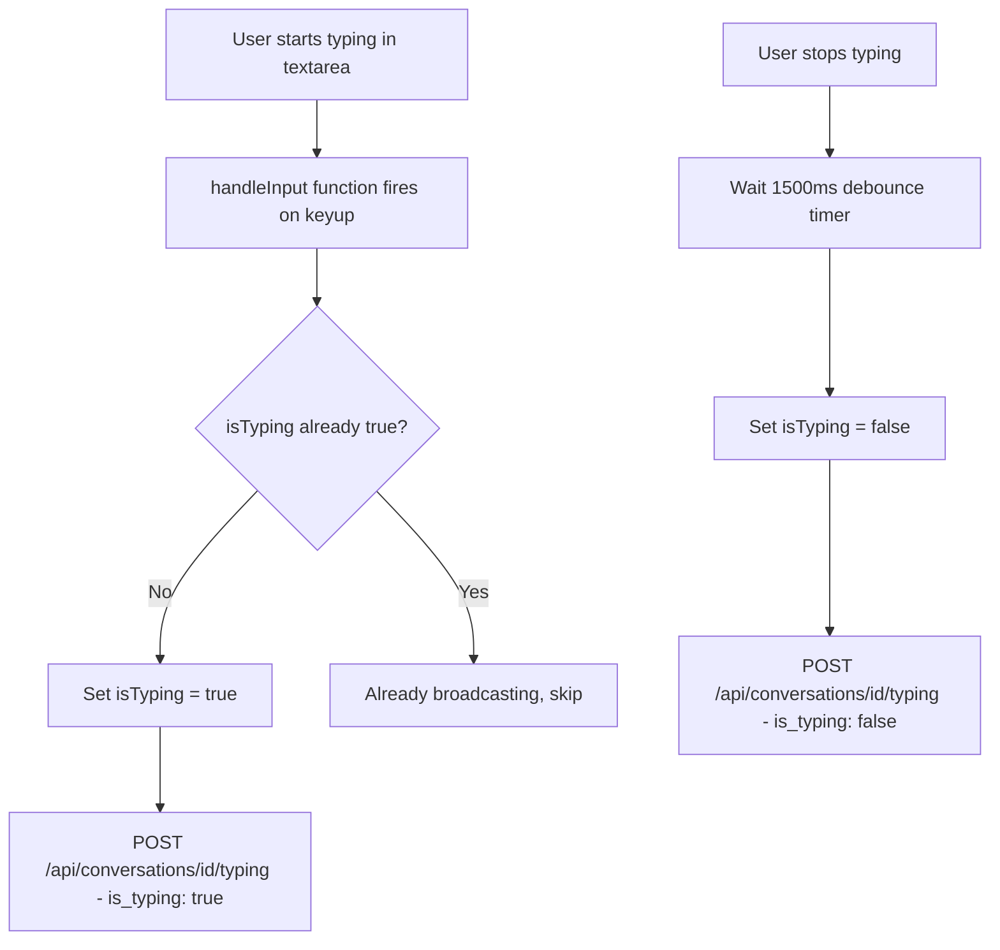
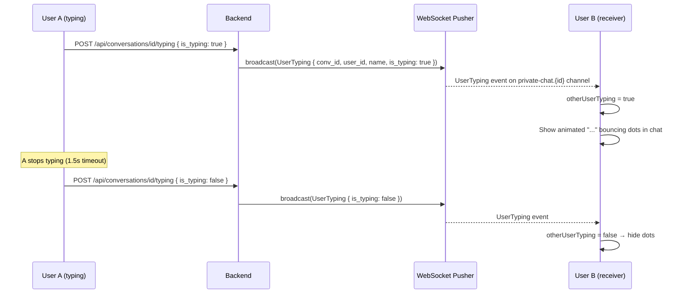
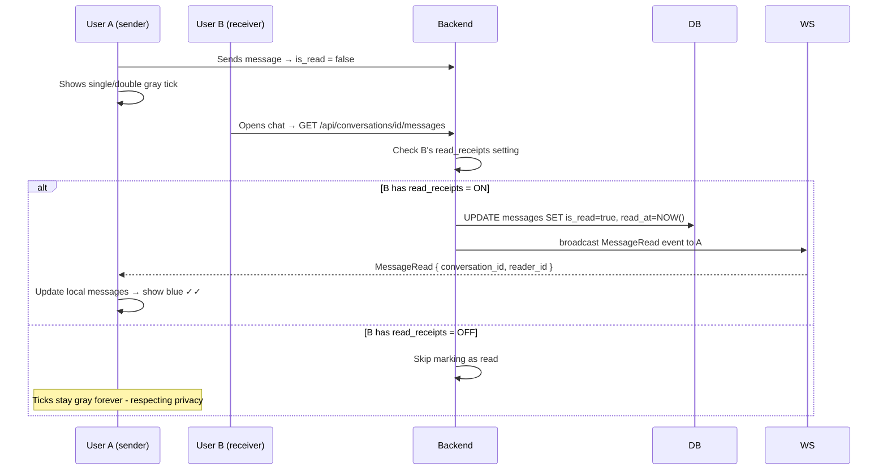
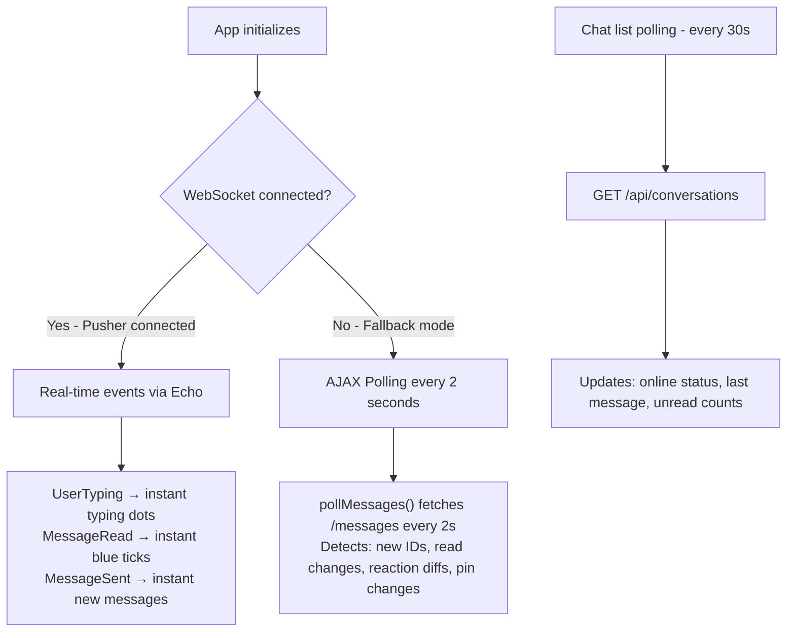

# 🟢 ChatPulse — Online / Offline Status System

> This document explains how the green online dot works, how last seen is tracked, how typing indicators function, and how the real-time presence system is architected.

---

## 1. Overview of Presence System



---

## 2. Database Fields for Presence

### `users` table columns used for presence:
| Column | Type | What it stores |
|---|---|---|
| `status` | enum | `online` or `offline` (or `banned`) |
| `last_seen_at` | timestamp nullable | When user was last active |

---

## 3. Online Status — How the Green Dot Works

### 3a. User Goes Online



### 3b. User Goes Offline



### 3c. How Other Users See the Status



### 3d. Green Dot in UI — Code Logic

```html
<!-- In sidebar conversation list -->
<span x-show="chat.other_user && chat.other_user.status === 'online'"
      class="absolute bottom-0 right-0 w-3 h-3 bg-emerald-500 rounded-full 
             border-2 border-white ring-1 ring-emerald-300 animate-pulse">
</span>
```

The `animate-pulse` Tailwind class creates the subtle pulsing animation on the green dot.

---

## 4. Last Seen Timestamp

### 4a. Privacy-Controlled Display



### 4b. Where Last Seen is Shown in UI

- **Chat header** → below the contact name ("Last seen today at 2:45 PM")
- **Profile cards** when clicking on a user's avatar
- **Search results** when initiating a new chat

---

## 5. Typing Indicator

### 5a. How the Sender Triggers It



### 5b. How the Receiver Sees It



### 5c. Typing Indicator UI

```html
<!-- Bouncing dots shown when other user is typing -->
<div x-show="otherUserTyping" class="flex items-center gap-1 px-3 py-2">
    <div class="flex gap-1 items-end">
        <span class="w-2 h-2 bg-gray-400 rounded-full animate-bounce" style="animation-delay:0ms"></span>
        <span class="w-2 h-2 bg-gray-400 rounded-full animate-bounce" style="animation-delay:150ms"></span>
        <span class="w-2 h-2 bg-gray-400 rounded-full animate-bounce" style="animation-delay:300ms"></span>
    </div>
    <span class="text-xs text-gray-400 ml-1" x-text="otherUserName + ' is typing...'"></span>
</div>
```

**WebSocket Channel:** `private-chat.{conversation_id}`
**Event:** `UserTyping`
**File:** `app/Events/UserTyping.php`

---

## 6. Read Receipts (Blue Ticks)

### 6a. Tick States

```
✓     = Gray single tick     → Message sent (stored in DB)
✓✓    = Gray double tick     → Message delivered (other side has loaded the chat)
✓✓    = Blue double tick     → Message read (other user opened the conversation)
```

### 6b. When Blue Ticks Appear



### 6c. Tick Rendering in UI

```javascript
// Alpine.js logic for tick color
function getTickColor(message) {
    if (message.sender_id !== currentUser.id) return ''; // not my message
    if (message.is_read) return 'text-blue-500';  // blue ticks
    return 'text-gray-400'; // gray ticks
}
```

---

## 7. Status Badge Colors

```
🟢 Emerald (#10b981)   = Online  (status = 'online')
⚫ Gray (#9ca3af)      = Offline (status = 'offline')
🔴 Red  (#ef4444)      = Banned  (status = 'banned') - shown in Admin Panel only
```

---

## 8. Polling vs WebSocket for Presence



> **Production Tip:** Set up Pusher credentials in `.env` to enable real WebSocket. Without it, the app gracefully degrades to 2-second AJAX polling.

---

## 9. Key Events & Channels Reference

| Event Class | Channel | Fired When | Data Broadcast |
|---|---|---|---|
| `MessageSent` | `private-chat.{id}` | New message | Full message object |
| `MessageRead` | `private-chat.{id}` | Chat opened by receiver | `conversation_id`, `reader_id`, `read_at` |
| `UserTyping` | `private-chat.{id}` | User starts/stops typing | `user_id`, `name`, `is_typing` |
| `ReactionUpdated` | `private-chat.{id}` | Emoji reaction toggled | `message_id`, `reactions[]` |
| `MessageDeleted` | `private-chat.{id}` | Message deleted | `message_id`, `is_moderated` |

---

## 10. Key Files Reference

| File | Purpose |
|---|---|
| `app/Events/UserTyping.php` | Typing indicator event |
| `app/Events/MessageRead.php` | Read receipt broadcast event |
| `app/Events/MessageSent.php` | New message broadcast event |
| `app/Events/ReactionUpdated.php` | Reaction sync event |
| `app/Events/MessageDeleted.php` | Delete sync event |
| `app/Http/Controllers/DashboardController.php` | `typing()`, `getMessages()` (read marks) |
| `resources/views/dashboard.blade.php` | Frontend presence UI + Echo listeners |
| `config/broadcasting.php` | WebSocket / Pusher configuration |
| `.env` | `PUSHER_APP_*` keys for WebSocket |
