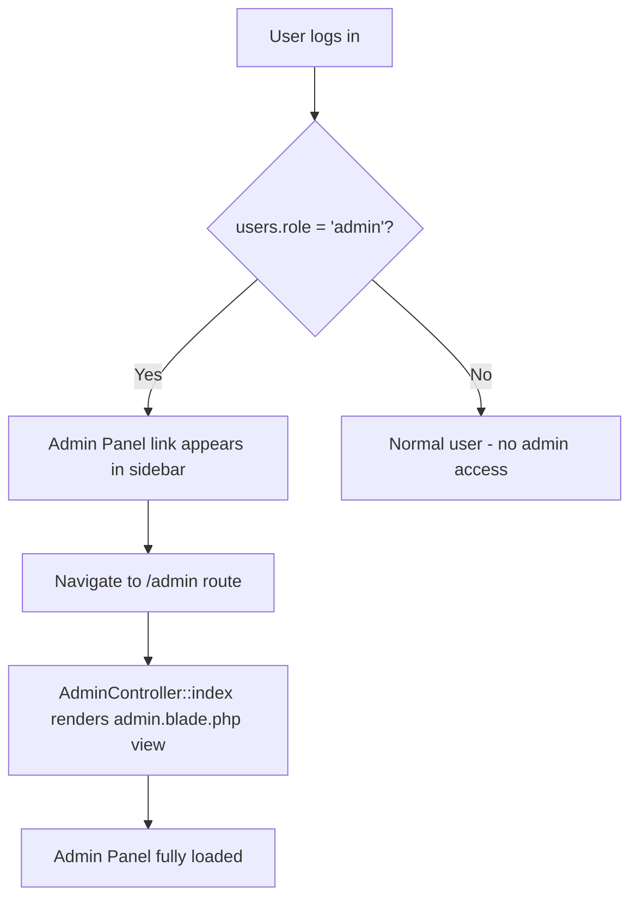
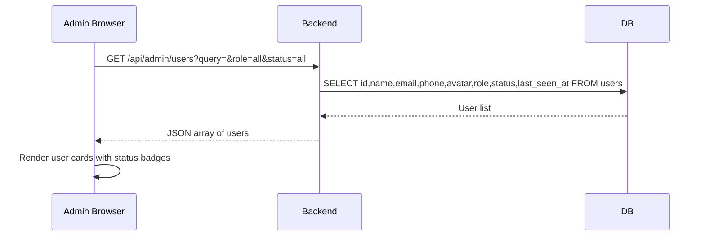
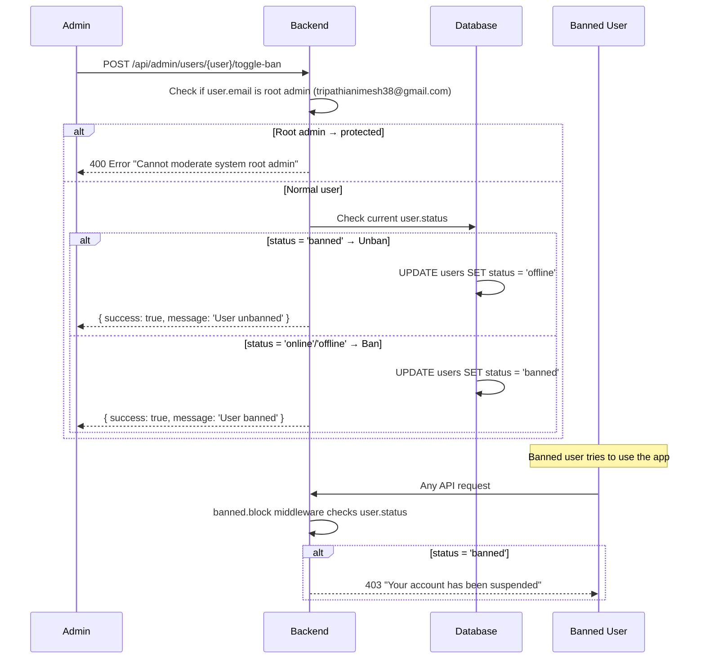
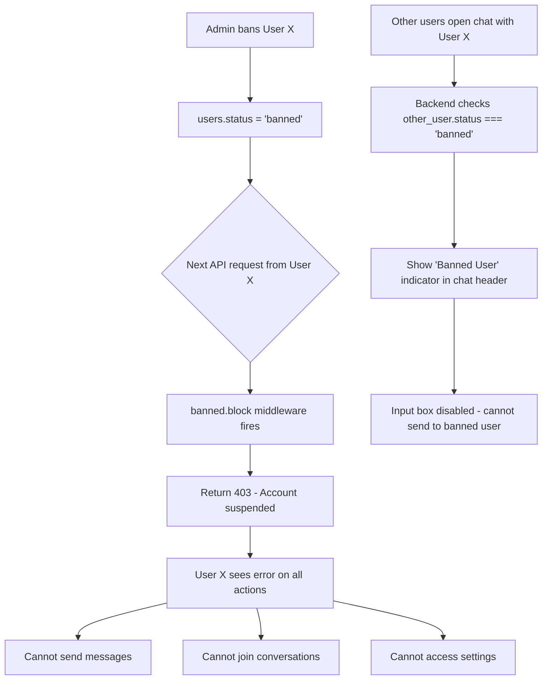
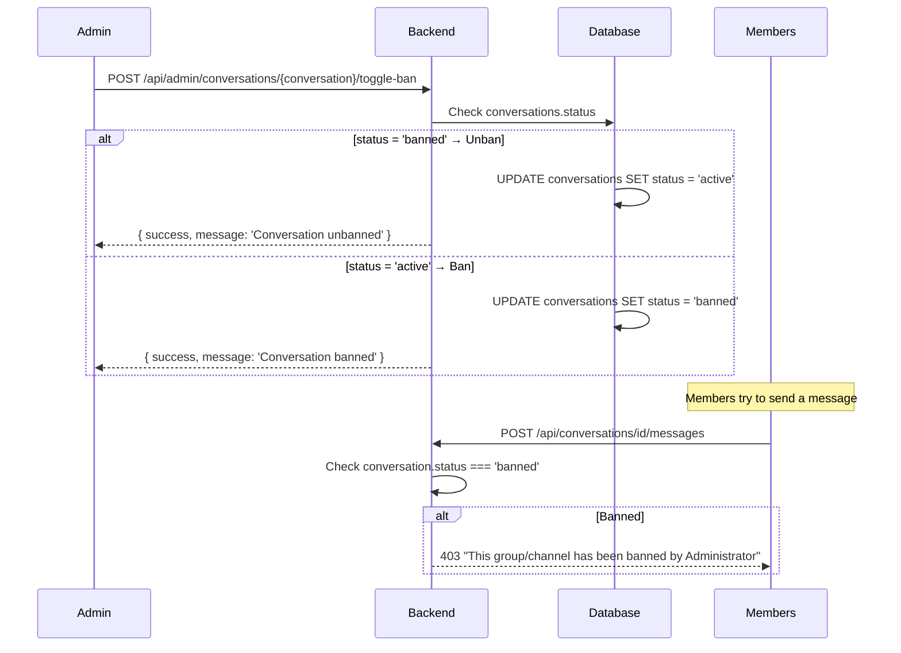
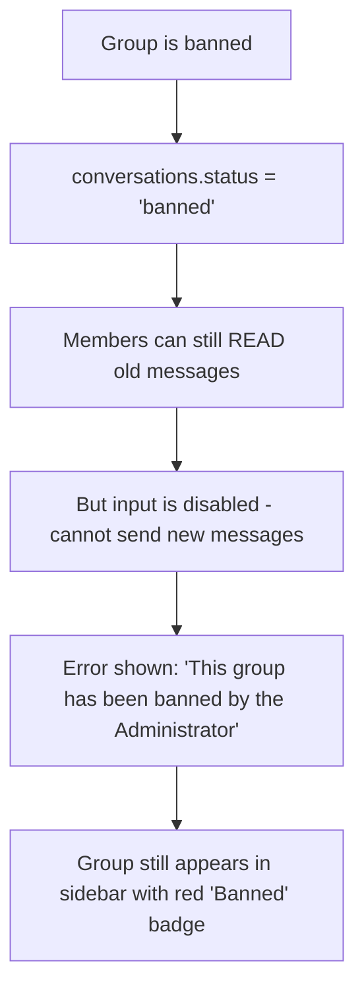
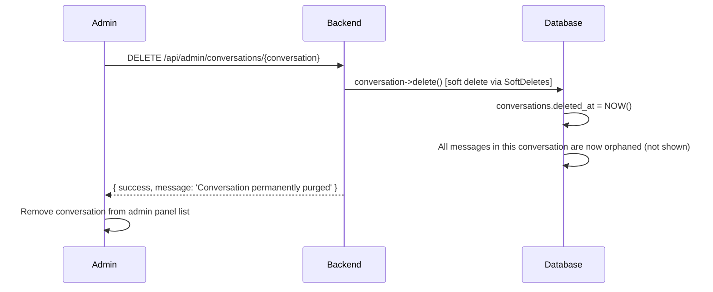
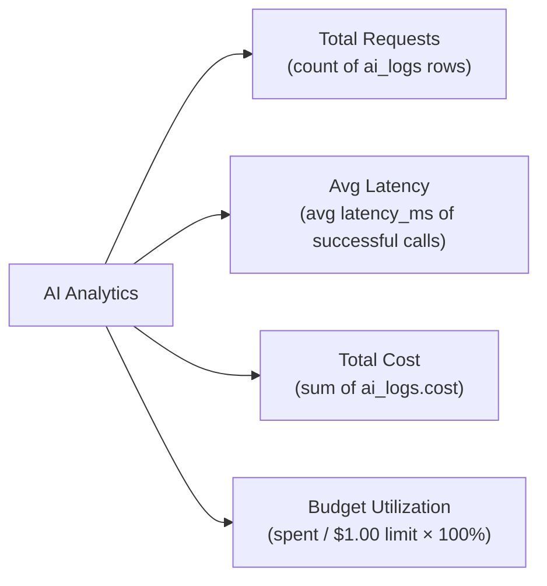
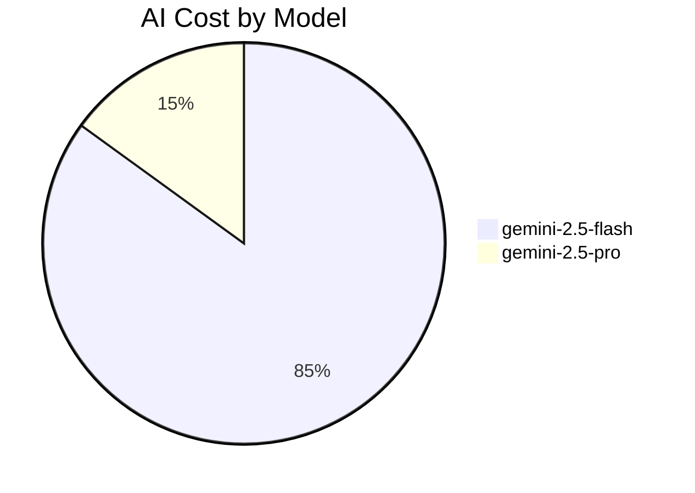

# 🛡️ ChatPulse — Admin Panel (Complete Reference)

> This document explains everything about the Admin Panel — how to access it, every feature it provides, and the exact code logic behind each action including banning users, banning groups, deleting conversations, and monitoring AI usage.

---

## 1. Admin Panel Access



**How to make a user admin:**
```sql
UPDATE users SET role = 'admin' WHERE email = 'your@email.com';
```

Or via Laravel Tinker:
```php
User::where('email', 'your@email.com')->update(['role' => 'admin']);
```

**Protection:** The admin panel routes use the `auth:sanctum` middleware + a role check. Normal users who try to access `/admin` or call admin API endpoints get a `403 Unauthorized` response.

---

## 2. Admin Panel Structure

```mermaid
graph TD
    A[Admin Panel - /admin] --> B[Users Management Tab]
    A --> C[Groups & Channels Tab]
    A --> D[AI Analytics Tab]

    B --> B1[View all users with status + role]
    B --> B2[Search users by name/email/phone]
    B --> B3[Filter by role - admin/user]
    B --> B4[Filter by status - active/banned]
    B --> B5[Ban a user]
    B --> B6[Unban a user]

    C --> C1[View all groups and channels]
    C --> C2[Search by name]
    C --> C3[Filter by type - group/channel]
    C --> C4[Filter by status - active/banned]
    C --> C5[Ban a group/channel]
    C --> C6[Unban a group/channel]
    C --> C7[Permanently delete a conversation]

    D --> D1[Total AI requests]
    D --> D2[Average API latency]
    D --> D3[Total API cost]
    D --> D4[Budget utilization bar]
    D --> D5[Recent AI generation logs]
    D --> D6[Cost breakdown by model]
    D --> D7[Real-time chart data]
```



---

## 3. User Management

### 3a. Loading the User List



**Filter Parameters:**
| Parameter | Values | Effect |
|---|---|---|
| `query` | any string | Search by name, email, or phone |
| `role` | `all`, `user`, `admin` | Filter by role |
| `status` | `all`, `active`, `offline`, `banned` | Filter by account status |

### 3b. Status Badges in Admin Panel

```
🟢 Online badge    = status = 'online'  (currently active)
⚫ Offline badge   = status = 'offline' (was active, now gone)
🔴 Banned badge   = status = 'banned'  (blocked by admin)
👑 Admin badge    = role = 'admin'
```

---

## 4. Banning a User

### 4a. How Ban Works



### 4b. What Happens When a User is Banned



### 4c. Banned User Middleware

**File:** `app/Http/Middleware/BannedBlock.php`

```php
// Every protected API route goes through this middleware
// If user.status === 'banned' → return 403 immediately
if ($user->status === 'banned') {
    return response()->json(['error' => 'Your account has been suspended.'], 403);
}
```

### 4d. Root Admin Protection

The email `tripathianimesh38@gmail.com` is hardcoded as the system root admin and **cannot be banned** by any admin action:

```php
if ($user->email === 'tripathianimesh38@gmail.com') {
    return response()->json(['error' => 'Cannot moderate the system root admin.'], 400);
}
```

---

## 5. Banning a Group or Channel

### 5a. How Group/Channel Ban Works



### 5b. Effect on Members When Group is Banned



---

## 6. Permanently Deleting a Conversation (Group/Channel)



> **Note:** This uses Laravel's `SoftDeletes` — the conversation row has `deleted_at` set, hiding it from all queries, but the data is not physically removed from the DB. This allows potential recovery by an engineer.

---

## 7. Admin Panel — Users Table Columns

| Column | What is shown |
|---|---|
| Avatar | Profile photo or DiceBear fallback |
| Name | Display name |
| Email | Login email |
| Phone | Phone number |
| Role | `user` or `admin` (badge) |
| Status | `online` / `offline` / `banned` (color badge) |
| Last Seen | `last_seen_at` formatted timestamp |
| Actions | **Ban / Unban** toggle button |

---

## 8. Admin Panel — Groups & Channels Table Columns

| Column | What is shown |
|---|---|
| Icon | Group/channel icon or fallback |
| Name | Group or channel name |
| Type | `group` or `channel` badge |
| Members | Count of members |
| Messages | Total message count |
| Activity | `Low` / `Medium` / `High` based on message count |
| Flagged | Count of messages with suspicious keywords |
| Status | `active` or `banned` badge |
| Actions | **Ban / Unban** toggle + **Delete** button |

**Activity Levels:**
- 🔴 Low → 0–3 messages
- 🟡 Medium → 4–10 messages
- 🟢 High → 11+ messages

**Flagged Keywords detected:** `phish`, `crypto`, `gift`, `free`, `click`

---

## 9. AI Analytics Dashboard

### 9a. Metrics Shown



### 9b. How AI Costs are Calculated

```
Cost per request = (tokens_used / 1000) × $0.00015

Where $0.00015 per 1k tokens is the Gemini 2.5 Flash pricing approximation.
Gemini 2.5 Pro requests use $0.00075 per 1k tokens.
```

### 9c. Recent AI Generations Log Table

Shows last 15 AI requests with:
- **Model** used (gemini-2.5-flash or gemini-2.5-pro)
- **Status** (success / failed)
- **Latency** in ms or seconds
- **Tokens** used
- **Prompt** (truncated to 60 chars)
- **Response** (truncated to 60 chars)
- **Time ago** (relative timestamp)

### 9d. Cost Breakdown by Model



Breakdown shows per-model:
- Token usage (e.g. `1.2k` tokens)
- Total cost (e.g. `$0.000180`)
- Percentage of total spend (progress bar)

### 9e. Chart Data

The AI analytics panel shows a bar/line chart of the last 8 AI requests showing:
- X-axis: Time of request (e.g. `14:30`)
- Y-axis left: Message volume (simulated from token count)
- Y-axis right: Latency in ms

---

## 10. Seed Data Behavior

If the `ai_logs` table is empty when the admin first loads, the system **auto-seeds 8 realistic demo entries** including:
- Content moderation calls (`SAFE`/`BAD` responses)
- Smart reply generations
- Chugli bot summaries
- Failed requests

This ensures the admin panel always looks populated even on a fresh install.

---

## 11. Admin API Routes Reference

| Method | Route | Action |
|---|---|---|
| `GET` | `/api/admin/users` | Get all users with filters |
| `POST` | `/api/admin/users/{user}/toggle-ban` | Ban or unban a user |
| `GET` | `/api/admin/ai-stats` | Get AI analytics + metrics |
| `GET` | `/api/admin/conversations` | Get all groups/channels with filters |
| `POST` | `/api/admin/conversations/{conversation}/toggle-ban` | Ban or unban a conversation |
| `DELETE` | `/api/admin/conversations/{conversation}` | Permanently delete |

All routes are wrapped in `auth` + `admin` middleware.

---

## 12. Key Files Reference

| File | Purpose |
|---|---|
| `app/Http/Controllers/AdminController.php` | All admin API logic |
| `app/Http/Middleware/BannedBlock.php` | Blocks banned users on every request |
| `app/Models/AILog.php` | AI request log model |
| `resources/views/admin.blade.php` | Admin panel HTML + Alpine.js UI |
| `routes/web.php` | Admin route definitions (lines ~70-73) |
| `database/migrations/*_create_ai_logs_table.php` | AI logs schema |
