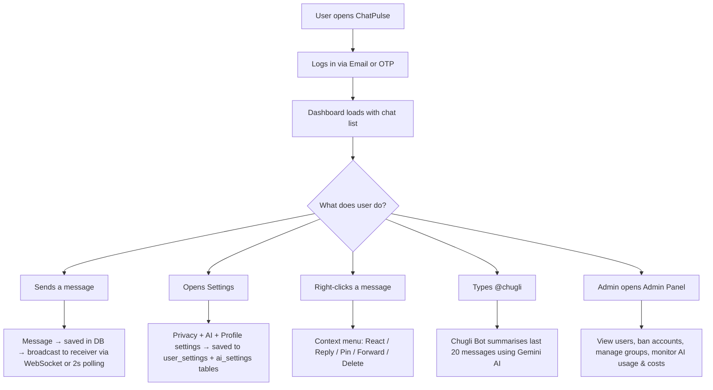

# 📚 ChatPulse — Documentation Index

Welcome to the **ChatPulse Technical Documentation**. Each file below covers one core feature area with diagrams, code references, and step-by-step flows.

---

## 📂 Files in this Folder

| # | File | What it covers |
|---|---|---|
| 1 | [01_messaging_system.md](./01_messaging_system.md) | How messages are sent in Direct, Group, and Channel chats — from basic text to media, replies, mentions, real-time delivery |
| 2 | [02_settings_system.md](./02_settings_system.md) | Every setting: profile, privacy, notifications, read receipts, AI autopilot, password change |
| 3 | [03_reactions_and_ai.md](./03_reactions_and_ai.md) | Emoji reactions, Pin message, Delete for Everyone, Forward — plus all AI features (Auto-Reply, Chugli Bot, Moderation, Smart Reply, AI Logs) |
| 4 | [04_online_status.md](./04_online_status.md) | Online/offline green dot, Last Seen, Typing indicator, Blue tick read receipts, real-time presence architecture |
| 5 | [05_admin_panel.md](./05_admin_panel.md) | Admin panel: ban/unban users, ban/unban groups & channels, delete conversations, AI analytics dashboard |

---

## 🚀 Quick Start — How ChatPulse Works in 1 Minute

---

## 🗂️ Project Tech Stack

| Layer | Technology |
|---|---|
| Backend | Laravel 11 (PHP 8.2) |
| Frontend | Alpine.js + Blade templates |
| Styling | Tailwind CSS (CDN) |
| Database | MySQL |
| Real-time | Laravel Echo + Pusher (AJAX polling fallback) |
| File Storage | Cloudinary CDN |
| AI Engine | Google Gemini 2.5 Flash API |
| Auth | Laravel Sanctum (token-based) |

---

## 🗃️ Core Database Tables

| Table | Purpose |
|---|---|
| `users` | All user accounts, status, role, avatar |
| `conversations` | Direct chats, Groups, and Channels |
| `messages` | Every message ever sent |
| `reactions` | Emoji reactions on messages |
| `conversation_user` | Group membership (with roles) |
| `channel_user` | Channel membership (with roles) |
| `conversation_invitations` | Pending invites to private groups/channels |
| `user_settings` | Privacy + notification preferences per user |
| `ai_settings` | AI autopilot settings per user |
| `ai_logs` | Audit trail of every AI API call |

---

## 📖 Reading Order (Recommended)

1. Start with **01_messaging_system.md** — understand the core message flow
2. Read **04_online_status.md** — understand the real-time layer
3. Read **03_reactions_and_ai.md** — understand message interactions
4. Read **02_settings_system.md** — understand user configuration
5. Read **05_admin_panel.md** — understand platform administration
